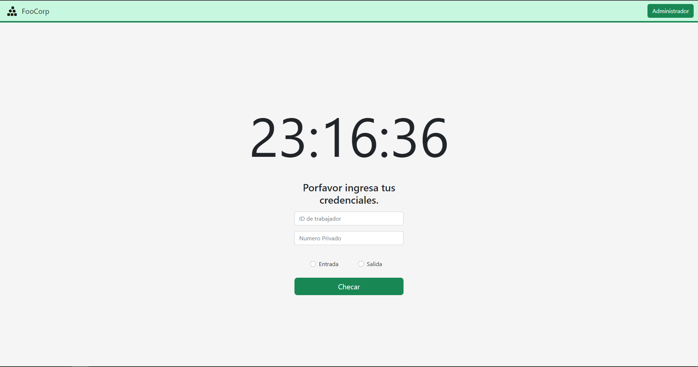

# Reloj Checador

     

##  Como ver el programa funcionando:
El programa se encuentra en el siguiente enlace:

https://reloj-checador.onrender.com/

Para el area de empleado checar la entrada y salida con los siguientes datos:
 
 -ID de trabajador: __1__

 -Numero Privado: __123456__

Para el area de administrador son los siguientes datos:
 
 -Nombre de usuario: __pepe__

 -Contrasena: __a123__

## Descripcion

Dentro de este Proyecto las actividades que hicimos fueron:
- Crear un modelo de baja fidelidad en el __UI__ para tener una base de diseno.
- Crear un diagrama de BD.
- Crear bases de datos en __PostgreSQL__.
- Crear varios __CRUD__ con formularios para las distintas funcionalidades.
- Dar estilos acorde al __UI__ planteado.
- Aplicar las reglas de la comunidad de Ruby para hacer mas legible el codigo.
- __Deployment__ del proyecto en Render.com.

## 🧑🏼‍🏭 Colaboradores:

- carloso0114 <carlossospinag@gmail.com>
- AlanGonzalezM <alangonzalez119@gmail.com>
- AangelF <aangel.flores.r@gmail.com>

## :iphone: Tecnologías:
- Visual Studio Code
- Ruby on Rails
- Git
- Github
- POO
- Rubocop
- Sandimeter
- Rubycritic

## :mag_right: Metodología de trabajo:
Mob Programming:
Mob Programming es un enfoque de desarrollo de software en el que todo el equipo trabaja en lo mismo, al mismo tiempo, en el mismo espacio y en la misma computadora. Esto es similar a la programación en pareja donde dos personas se sientan en la misma computadora y colaboran en el mismo código al mismo tiempo. Con la programación mob, la colaboración se extiende a todos los miembros del equipo, sin dejar de usar una sola computadora para escribir el código e ingresarlo en la base del código.